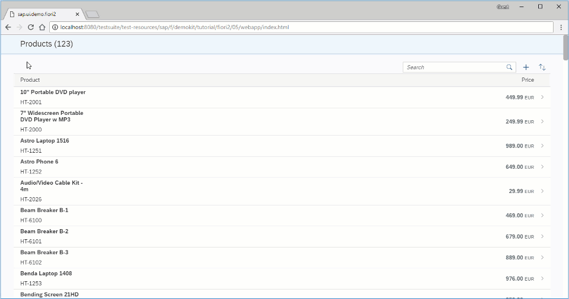

# Using Object Page Layout as a Detail Page

Thêm `sap.uxap.ObjectPageLayout` để hiển thị thông tin từng product

`ObjectPageLayout` cung cấp cho phép app dễ dàng hiển thị thông tin liên quan đến business object

Sau version 1.52, `sap.f.DynamicPage`. Điều này đảm bảo tính khả dụng của các tính năng SAP Fiori, chẳng hạn như điều hướng theo đường dẫn, tác vụ điều hướng và mở rộng/thu gọn tiêu đề bằng cách nhấn/nhấp vào khu vực tiêu đề hoặc bằng cách chọn các nút mũi tên có sẵn.`Object Page Headers`

`sap.uxap.ObjectPageLayout` cung cấp nội dung có cấu trúc chặt chẽ hơn bằng cách sử dụng thanh neo tùy chọn và chặn nội dung được gói trong các phần và phần phụ cấu trúc thông tin. Để biết thêm thông tin, hãy xem `Object Page Layout`.



```xml
<mvc:View
	xmlns="sap.uxap"
	xmlns:m="sap.m"
	xmlns:f="sap.f"
	xmlns:form="sap.ui.layout.form"
	xmlns:mvc="sap.ui.core.mvc">
	<ObjectPageLayout
		id="ObjectPageLayout"
		showTitleInHeaderContent="true"
		alwaysShowContentHeader="false"
		preserveHeaderStateOnScroll="false"
		headerContentPinnable="true"
		isChildPage="true"
		upperCaseAnchorBar="false">
	</ObjectPageLayout>
</mvc:View>
```

`sap.uxap.ObjectPageLayout`
